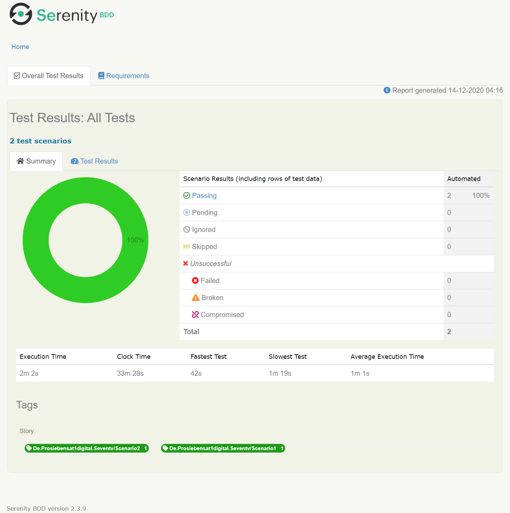
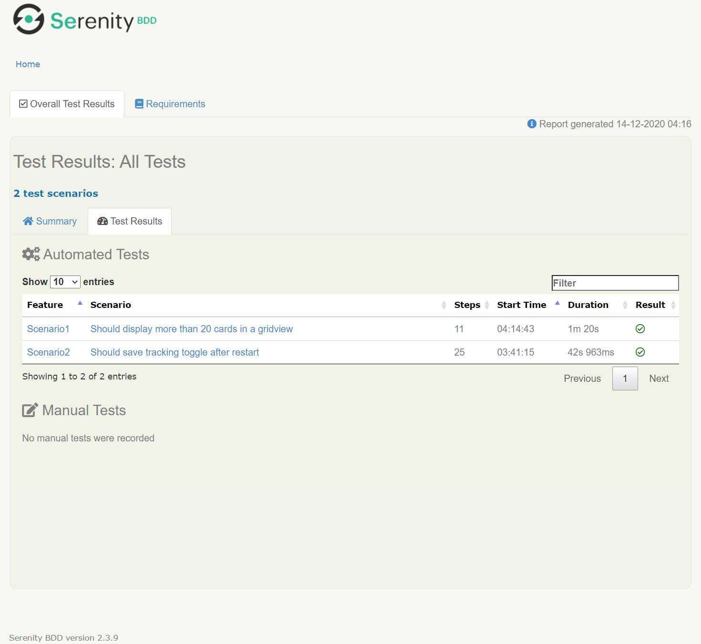
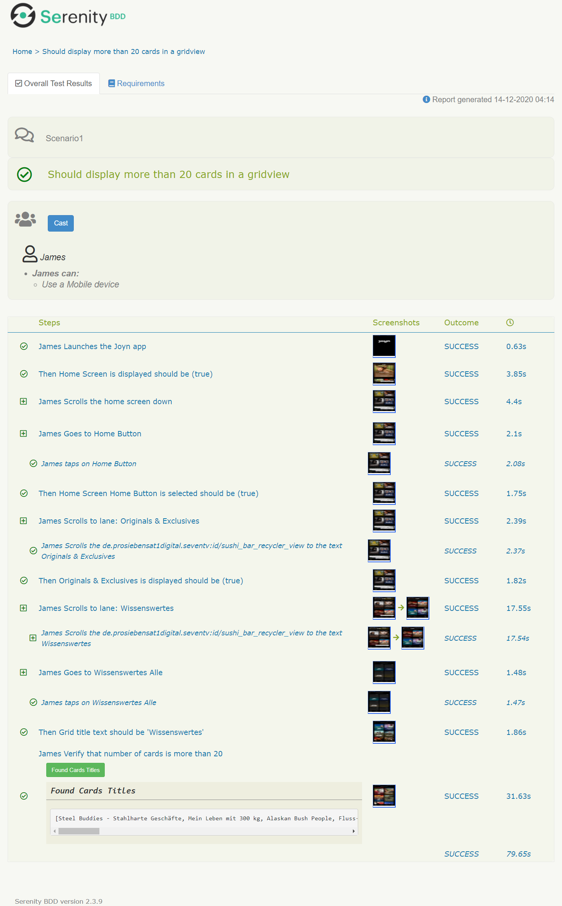
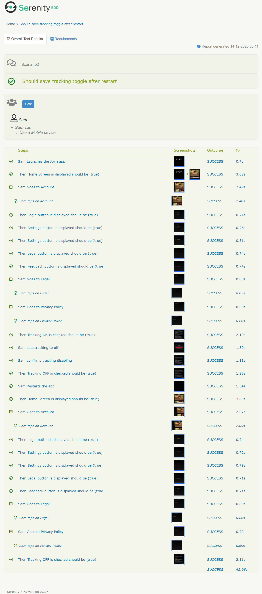

<p align="center">
  <a href="https://github.com/ol-le/screenplay">
    
  </a>

<h3 align="center">Screenplay</h3>

  <p align="center">
    Mobile UI tests automation of the Joyn app
    <br />
  </p>


<details open="open">
  <summary><h2 style="display: inline-block">Table of Contents</h2></summary>
  <ol>
    <li>
      <a href="#about-the-project">About The Project</a>
      <ul>
        <li><a href="#built-with">Built With</a></li>
      </ul>
    </li>
    <li>
      <a href="#getting-started">Getting Started</a>
      <ul>
        <li><a href="#prerequisites">Prerequisites</a></li>
        <li><a href="#installation">Installation</a></li>
        <li><a href="#execution">Execution</a></li>
        <li><a href="#execution">Arguments</a></li>
      </ul>
    </li>
    <li><a href="#results">Results</a></li>
  </ol>
</details>


## About The Project

Basic implementation of android ui test scenarios using Appium + SerenityBDD framework




### Built With

* [Appium](https://github.com/appium)
* [SerenityBDD](https://github.com/serenity-bdd/)


<!-- GETTING STARTED -->
## Getting Started

To be able to execute the tests you would need to have Java set up on your machine.
You will also need an Appium server instance running. If you want to run the tests locally make sure you installed appium and configured it accordingly

### Prerequisites

Install appium if you want to execute tests locally
  ```sh
  npm install appium@latest -g
  ```

### Installation

Clone the repo
   ```sh
   git clone https://github.com/ol-le/screenplay.git
   ```

### Execution
 Execute the tests with the next command
   ```sh
   ./gradlew test
            -Dappium.hub={APPIUM_SERVER_URL}
            -Dwebdriver.driver=appium
            -Dappium.platformName=ANDROID
            -Dappium.automationName=UIAutomator2
            -Dappium.deviceName=phone
            -Dappium.platformVersion={PLATFORM_VERSION}
            -Dappium.app={FULL_PATH_TO_APK}
            -Dwebdriver.timeouts.implicitlywait=10000
            -Dorg.slf4j.simpleLogger.defaultLogLevel=debug
   ```


### Arguments:


**APPIUM_SERVER_URL**
* if you run appium server locally with default settings `http://127.0.0.1:4723/wd/hub`


**FULL_PATH_TO_APK**

Location of the application file .apk (should be located on the machine, where appium server is running)


**PLATFORM_VERSION**
* Android version of your device, e.g `10`


## Results

After executing the tests the test results can be found here


| | **Path**|
| --- | --- |
|**Serenity report** | `target/site/serenity/index.html`|

Here is how the serenity report looks like
<p align="center">
  
  
  
</p>